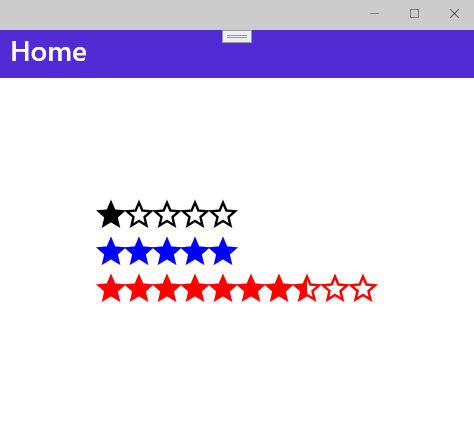

# Simple Rating Control for .NET MAUI

This repository contains a Simple Rating Control using a font in .NET MAUI. It is available for all supported platforms, like *Android*, *iOS*, *Windows*, *Mac Catalyst* or *Tizen*.

---

## Screenshots

### Android 


### Windows 



---

## Usage


```xaml
<controls:SimpleRatingControl Amount="5"
                              CurrentValue="1"
                              AccentColor="Black"
                              StarSize="36" />
```

---

## Available Properties

| Property       | Type     | Description                                              | Default Value |
|----------------|----------|----------------------------------------------------------|---------------|
| `CurrentValue` | `double` | Sets the value which should be used as the rating.       | `0`           |
| `Amount`       | `double` | Sets the amount of the maximum amount of possible stars. | `10`          |
| `StarSize`     | `double` | Sets the size of each star.                              | `24`          |
| `AccentColor`  | `Color`  | Sets the color of the stars.                             | `Red`         |

---

## Links

[Medium Post (English)](https://medium.com/@tsjdevapps/net-maui-create-a-simple-rating-control-560566fa5014)
